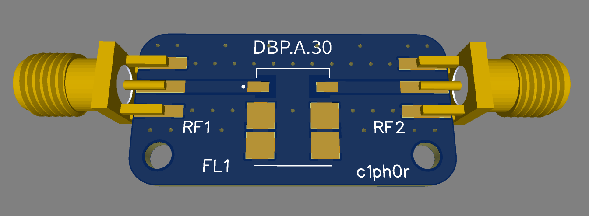
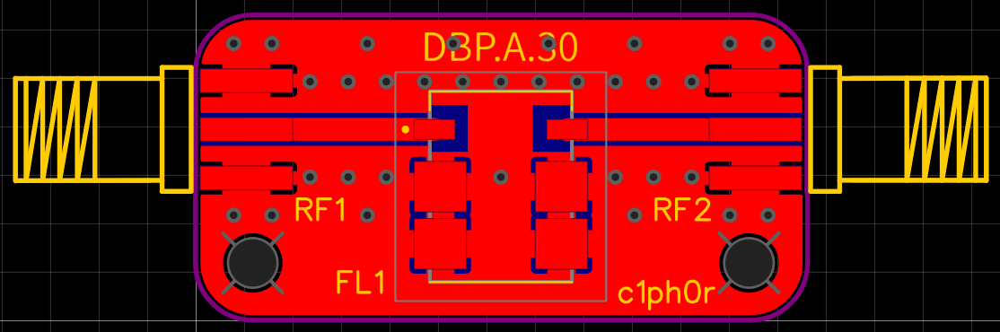
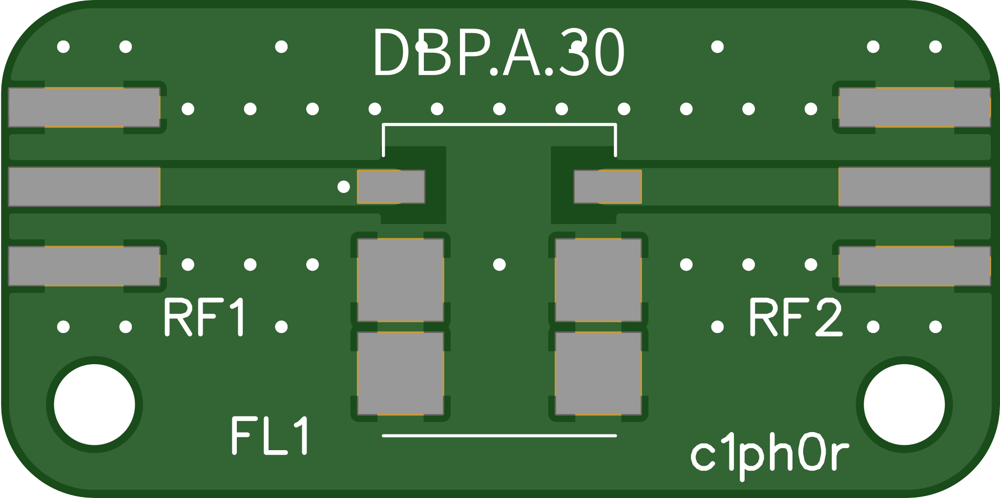
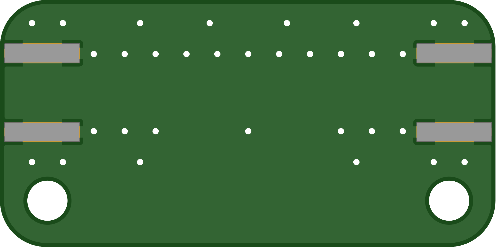

# LoRa Dual-Band Pass Filter PCB (433 MHz & 868 MHz)

[](https://opensource.org/licenses/CERN)
[](https://kicad.org/)

## About

An open-source, high-performance RF Band Pass Filter (BPF) PCB designed specifically for LoRa and IoT applications operating in the **433 MHz** and **868 MHz** ISM bands. 

This board mitigates out-of-band noise, suppresses harmonics, and prevents desensitization of the LoRa receiver caused by nearby strong signals (such as cellular networks or high-power broadcast transmitters). It is ideal for deployment in LoRaWAN Gateways, specialized node setups, and SDR operations.

---

## Features

- **Dual-Band Capabilities:** Supports both 433 MHz and 868 MHz standard LoRa frequencies (dependent on component population or RF switch routing).
- **Ultra-Low Insertion Loss:** Optimized impedance lines (50 Ohm) to ensure minimal signal degradation.
- **Compact Form Factor:** Standard footprints for discrete components, and standardized LTCC/SAW filter footprints.
- **RF Connectors:** Edge-launch SMA female connectors for direct integration between your antenna and LoRa transceiver (e.g., SX1276, SX1262).
- **Flexible Design:** Can be populated with either 433 or 868 MHz filter.

---

## Schematic & Topology



The PCB implements standard 50ohm coplanar waveguide with ground (CPWG) transmission lines. 

```text
[ ANTENNA IN ]                                             [ TRANSCEIVER OUT ]
  +----------+       +-------------------------------+         +----------+
  |  J1 SMA  | ===== |                LF1            | ======= |  J2 SMA  |
  |  Female  |       |  Integrated Band Pass Filter  |         |   Male   |
  +----------+       +-------------------------------+         +----------+
                           |                    |
                         [GND]                [GND]
```

The filter configuration can be populated utilizing high-performance components in two ways:
1. **433 MHz Filter Path:** LCSC Part `C5624220` (Taoglas DBP.433.T.A.30).
2. **868 MHz Filter Path:** LCSC Part `C6831308` (Taoglas DBP.868.U.A.30).

Female headers (50ohm):
- $50\ \Omega$ RF SMA Female End-Launch (Edge-Mount) PCB Connector: LCSC part number `C496550`

The PCB is tunned for the 433 MHz footprint but the 868 MHz is only slightly different (larger in length and slightly wider) and may be compatible.
In the future I will share separate PCB gerber files com each component or design a universal pad layout.

---

## Bill of Materials (BOM)

| Reference Designator | Qty | LCSC Part Number | Component Package | Description | Manufacturer / Part Number |
| :--- | :---: | :--- | :---: | :--- | :--- |
| **J1, J2** | 2 | **C496550** | Edge-Launch / End-Launch | RF SMA Female and Male Antenna Connector ($50\ \Omega$, DC–12.4 GHz) | Bat Wireless / `BWSMA-KE-P001`  |
| **U1 (433 MHz Option)** | 1 | **C5624220** | SMD (LTCC) | 433 MHz Dielectric Bandpass Filter | Taoglas / `DBP.433.T.A.30` |
| **U2 (868 MHz Option)** | 1 | **C6831308** | SMD (LTCC) | 868 MHz Dielectric Bandpass Filter | Taoglas / `DBP.868.U.A.30` |

*\*Note: This PCB design utilizes a configurable layout strategy. Solder **only** U1 if you need a 433 MHz filter, or **only** U2 if you need an 868 MHz filter. Do not populate both positions simultaneously on a single shared RF trace line unless your schematic includes an active SPDT RF switch routing matrix.*

---

## PCB Fabrication Guidelines




To ensure the RF traces maintain a strict $50\ \Omega$ characteristic impedance, follow these stackup guidelines during manufacturing:

- **Material:** FR-4 (Tg 130-140 or higher)
- **Layer Count:** 2-Layer (solid ground reference)
- **PCB Thickness:** 1.6mm (CPWG trace width calculated for board thickness: 1.2mm track width and 0.15mm track spacing)
- **Surface Finish:** ENIG (Electroless Nickel Immersion Gold) is highly recommended for RF performance and solderability.
- **Copper Weight:** 1 oz (35 µm) outer layers

---

## Assembly & Testing

1. **Solder the SMD Components:** Apply solder paste and use a hot-air rework station or reflow oven to mount the integrated filter (`U1`) and discrete components. 
2. **Attach SMA Connectors:** Hand-solder the edge-launch SMA connectors ensuring a solid ground connection on both top and bottom layers.
3. **RF Characterization (Optional but Recommended):** - Connect the board to a **Vector Network Analyzer (VNA)**.
   - Calibrate the VNA using a standard Short-Open-Load-Thru (SOLT) kit.
   - Measure **S21 (Insertion Loss/Bandpass profile)** and **S11 (Return Loss)** to verify that the center frequency aligns properly with 433 MHz or 868 MHz, respectively.

---

## License

This project is licensed under the CERN Open Hardware Licence Version 2 – Strongly Reciprocal (CERN OHL-S v2). See the [LICENSE](LICENCE) file for full conditions.

## Disclaimer

RF transmission is subject to local legal regulations (e.g., FCC, CE). Ensure your final assembly stays within allowed transmission power levels and spurious emission boundaries for the ISM bands in your region.
