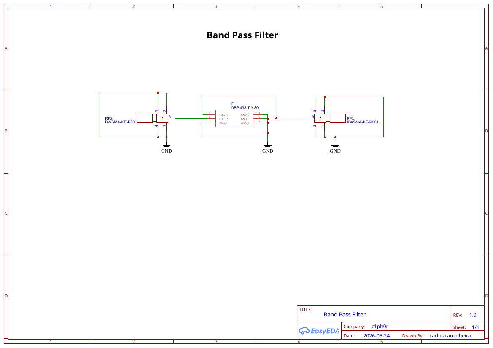

# LoRa Dual-Band Pass Filter PCB (433 MHz & 868 MHz)

## About

An open-source, high-performance RF Band Pass Filter (BPF) PCB designed specifically for LoRa and IoT applications operating in the **433 MHz** and **868 MHz** ISM bands. 

This board mitigates out-of-band noise, suppresses harmonics, and prevents desensitization of the LoRa receiver caused by nearby strong signals (such as cellular networks or high-power broadcast transmitters). It is ideal for deployment in LoRaWAN Gateways, specialized node setups, and SDR operations.

---

## Features

- **Dual-Band Capabilities:** Supports both 433 MHz and 868 MHz standard LoRa frequencies (dependent on component population or RF switch routing).
- **Ultra-Low Insertion Loss:** Optimized impedance lines (50 Ohm) to ensure minimal signal degradation.
- **Compact Form Factor:** Standard footprints for discrete components, and standardized LTCC/SAW filter footprints.
- **RF Connectors:** Edge-launch SMA female connectors for direct integration between your antenna and LoRa transceiver (e.g., SX1276, SX1262).
- **Flexible Design:** Can be populated with either 433 or 868 MHz filter.

---

## Schematic & Topology

The PCB implements standard 50ohm coplanar waveguide with ground (CPWG) transmission lines. The filter configuration can be populated in two ways:
1. **Integrated LTCC Filter Path:** Utilizing high-performance components like the LCSC Part `C5624220` (or similar footprint variations).

---

## Bill of Materials (BOM)

Below is the component list required to build one unit. The PCB accommodates both frequencies, but you must select the respective components for your desired target band (433 MHz or 868 MHz).

| Reference Designator | Qty | Value / Part Number | Package | Description | Manufacturer / LCSC Link |
| :--- | :---: | :--- | :---: | :--- | :--- |
| **U1** | 1 | C5624220 / Filter | SMD-4 / SMD-6 | SMD Multi-layer LTCC Band Pass Filter | [LCSC Datasheet](https://www.lcsc.com/datasheet/C5624220.pdf?spm=wm.fly.bg.0.pdf&lcsc_vid=RABcVlJeTlUIUFRWQlFbUVwFE1EPX1QEQFdcUVIEQ1ExVlNRTlZaUFVXQVhWVjsOAxUeFF5JWBYZEEoKFBINSQcJGk4dAgUUFAk%3D) |
| **J1, J2** | 2 | SMA-KE | Edge-Launch | SMA Female Edge Mount Connector, $50\ \Omega$ | Generic / LCSC |
| **C1, C3\*** | 2 | *See Note* | 0402 / 0603 | RF Capacitor, Low-ESR, COG/NP0 (Optional LC path) | Murata / Samsung |
| **L1\*** | 1 | *See Note* | 0402 / 0603 | RF Wire-wound Inductor, High-Q (Optional LC path) | Murata / Sunlord |
| **PCB** | 1 | LoRa BPF PCB | - | FR4, 1.6mm thickness, 2-layer or 4-layer | Custom |

*\*Note: C1, C3, and L1 discrete footprints are provided on-board as placeholders for fine-tuning or for substituting the integrated filter with a lumped-element network if desired. If using the `C5624220` integrated IC filter, bypass these footprints with $0\ \Omega$ resistors or solder bridges as defined by the schematic routing.*

---

## PCB Fabrication Guidelines

To ensure the RF traces maintain a strict $50\ \Omega$ characteristic impedance, follow these stackup guidelines during manufacturing:

- **Material:** FR-4 (Tg 130-140 or higher)
- **Layer Count:** 2-Layer (solid ground reference)
- **PCB Thickness:** 1.6mm (CPWG trace width calculated for board thickness: 1.2mm track width and 0.15mm track spacing)
- **Surface Finish:** ENIG (Electroless Nickel Immersion Gold) is highly recommended for RF performance and solderability.
- **Copper Weight:** 1 oz (35 µm) outer layers

---

## Assembly & Testing

1. **Solder the SMD Components:** Apply solder paste and use a hot-air rework station or reflow oven to mount the integrated filter (`U1`) and discrete components. 
2. **Attach SMA Connectors:** Hand-solder the edge-launch SMA connectors ensuring a solid ground connection on both top and bottom layers.
3. **RF Characterization (Optional but Recommended):** - Connect the board to a **Vector Network Analyzer (VNA)**.
   - Calibrate the VNA using a standard Short-Open-Load-Thru (SOLT) kit.
   - Measure **S21 (Insertion Loss/Bandpass profile)** and **S11 (Return Loss)** to verify that the center frequency aligns properly with 433 MHz or 868 MHz, respectively.

---

## License

This project is licensed under the CERN Open Hardware Licence Version 2 – Strongly Reciprocal (CERN OHL-S v2). See the [LICENSE](LICENCE) file for full conditions.

## Disclaimer

RF transmission is subject to local legal regulations (e.g., FCC, CE). Ensure your final assembly stays within allowed transmission power levels and spurious emission boundaries for the ISM bands in your region.
